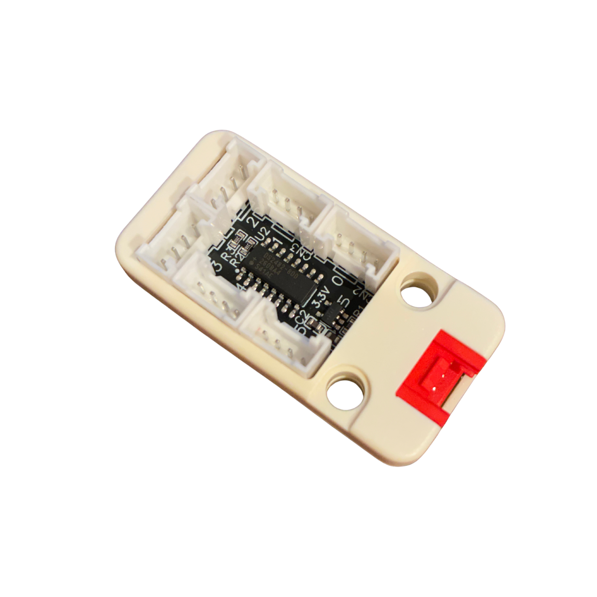
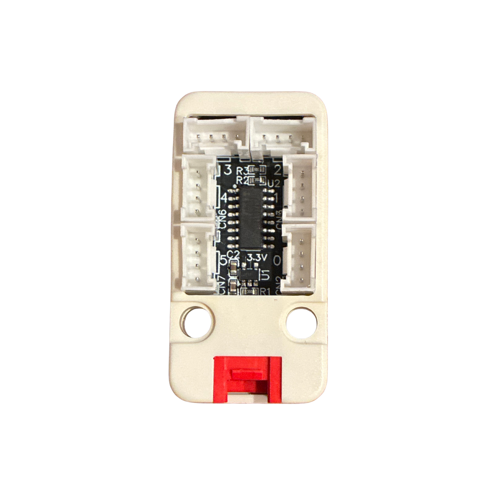
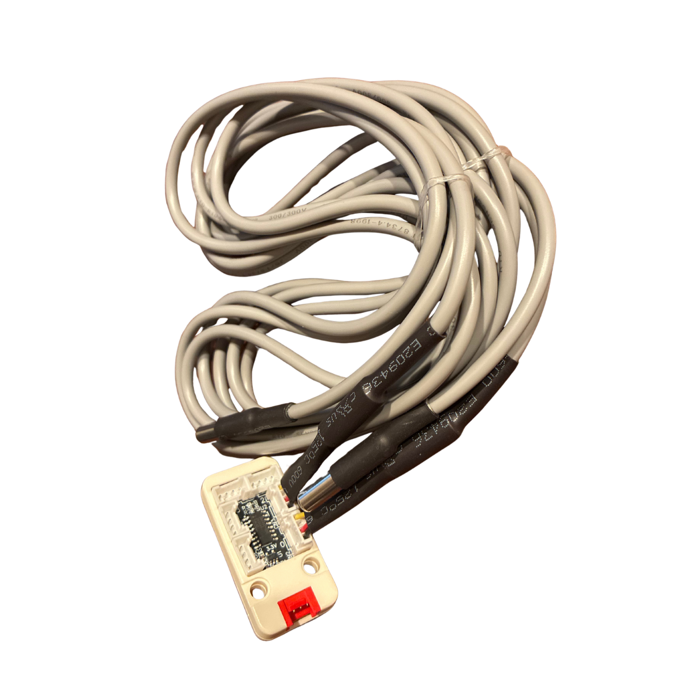

# 1-Wire Hub Module for M5Stack Unit

DS2482-800（I2C to 1-Wireブリッジ）を搭載し、M5Stackで複数の1-Wireデバイスを簡単に扱うためのGrove接続モジュールです。

---

## 概要

DS2482S-800を搭載した1-Wireハブユニットです。Grove（I2C）インターフェースにより、M5Stackシリーズと簡単に接続できます。

1つのGrove接続から最大8ch（本リポジトリのサンプルは6ch対応）の1-Wireバスに分岐でき、DS18B20温度センサーなどの1-Wireデバイスをチャンネルごとに独立して読み取れます。

通常の1-Wireバスは複数デバイスを1本の線に相乗り（マルチドロップ）させるため、どのセンサーがどれかをROM ID（64bitのシリアル番号）で識別・管理する必要があります。ROM IDは単なる数値の羅列であり、それだけでは「このIDのセンサーが物理的にどこに設置されているものか」を一目で判断できず、事前に1本ずつ接続してIDを控える、あるいはラベルを貼るといった対応付け作業が必要になりがちです。本モジュールはコネクタ単位でチャンネルが分かれているため、**どのコネクタに挿したセンサーか＝どのチャンネルのデータか**が物理的に一目でわかり、ROM IDによる対応付け作業が不要です。

付属のライブラリとサンプルコードを使用することで、

- DS2482-800とのI2C通信確認
- 複数チャンネルのDS18B20温度読み取り

をすぐに試すことができます。

---

## 特徴

- DS2482-800（I2C to 1-Wireブリッジ、8ch）搭載
- コネクタごとにチャンネルが独立しており、どのコネクタに何のセンサーを接続したかが物理的に明確（ROM IDによる識別が不要）
- M5Stackシリーズと高い親和性
- Grove（I2C）接続
- DS18B20など1-Wireデバイスに対応
- ライブラリ同梱（OneWireMaster / DS2482 / DS18B20）

---

## 必要なもの

- M5Stack本体
- 本モジュール（1-wire-hub-m5-unit）
- 1-Wireデバイス（DS18B20など）

---

## 接続方法

Groveポートに接続して使用します。

---

## 想定用途

- 多点温度計測
- 各種1-Wireセンサーの読み取り
- 設備・環境モニタリング

---

## Examples

本リポジトリにはサンプルを用意しています。各サンプルはそれぞれ独立したPlatformIOプロジェクトで、依存ライブラリも各サンプル配下の`lib/`に個別に置かれています（サンプル間で共有はしていません）。

### basic

DS2482-800とのI2C通信のみを確認するサンプル。

- Device Reset
- Status読出し
- Channel Select

### ReadTemperature

DS2482とDS18B20を組み合わせ、ch0〜ch5に接続したDS18B20から温度を読み取りLCD・シリアルに表示するサンプル。詳細は [examples/ReadTemperature/README.md](./examples/ReadTemperature/README.md) を参照。

---

## ライブラリ構成

- `OneWireMaster` — 1-Wireバスマスタの抽象インターフェース。デバイスドライバとバス実装を分離するための最小I/F。
- `DS2482` — DS2482-800のチップ制御（Device Reset／Status／Channel Select）と1-Wireビット操作を行うライブラリ。
- `DS18B20` — DS18B20（1-Wire温度センサー）のドライバ。`OneWireMaster`インターフェースにのみ依存し、バス実装を問わず使用可能（Skip ROM使用のため単独接続前提）。

---

## 動作環境

- [PlatformIO](https://platformio.org/)
- Framework: Arduino
- Board: `m5stack-core-esp32`（各サンプルの `platformio.ini` を参照）
- 依存ライブラリ: [M5Unified](https://github.com/m5stack/M5Unified)

---

## 購入先

[スイッチサイエンス](https://www.switch-science.com/search?q=xmakers)

[BASE](https://xmakers.base.shop/)

---

## ライセンス

[MIT License](LICENSE)
